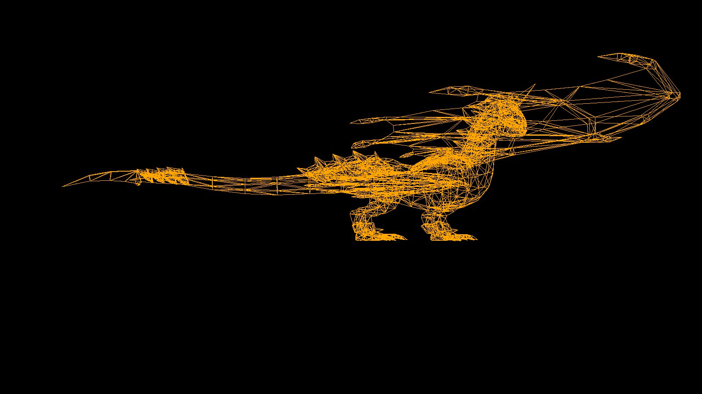

# 3D-Mathematic-Mesh-Visualizer

Это инструмент, который принимает на вход OBJ-файл, парсит его геометрию и автоматически строит трёхмерную сетку (grid/mesh) для визуализации.
Эта программа была создана как полезный инструмент при работе с 3D-моделями и математическими поверхностями.

# ✨ Возможности
Загрузка и парсинг .obj файлов
Построение трёхмерной сетки на основе вершин и граней
Визуализация 3D-объектов
Возможность поворота / зума модели
Подсветка вершин и рёбер
Поддержка высокополигональных моделей

# 🛠️ Технологии
* Python 3.x
* NumPy - работа с векторами и матрицами
* Numba - работа с матричнами функциями 
* PyGame - для отрисовки интерфейса и кадров
* Возможная поддержка:
* pywavefront
* trimesh

# 📦 Структура проекта
grafic/  
│  
├── __init__.py                # точка входа  
├── camera.py                  # функции для врашения и перемешения камеры  
├── matrix_functioons.py       # матричные переобразования  
├── object_3D.py               # парсинг 3D обЪектов и их визуализация  
├── projection.py              # построение проекций  
└── main.py                    # оснавные функции для управления программы  
│  
├── resources/  
│   ├── torus.obj  
│   ├── sphere.obj  
│   ├── monkey.obj  
│   └── screenshot.png    # пример результата  
│  
└── README.md  

# ▶️ Как запустить
1. Установить зависимости:
pip install -r requirements.txt

3. Запустить визуализатор:
python main.py

4. Открыть интерактивное 3D-окно
Используй клавытуру для вращения и зума.

# 🧪 Пример использования
Входной файл (sphere.obj):
v 0.0000 1.0000 0.0000
v 0.7236 0.4472 0.5257
v -0.2764 0.4472 0.8506
...
f 1 2 3
f 2 3 4
...

# Визуализация:

# 🔍 Как это работает

1. Парсер OBJ извлекает:
* список вершин
* список граней
* нормали (если есть)
* UV-координаты (если есть)
2. Программа нормализует модель:
* перенос в центр
* масштабирование под единичный куб
* построение сетки
3. Система визуализации рендерит модель в интерактивном окне:
* вершины подсвечиваются,
* рёбра соединяются линиями,
* можно вращать/зумить модель.

# 🚀 Планы по развитию (опционально)

* Поддержка STL / PLY
* Экспорт сетки в OBJ
* Поддержка шейдеров
* Wireframe режим
* Вращение модели по оси анимацией
* GUI на PyQt или Tkinter

